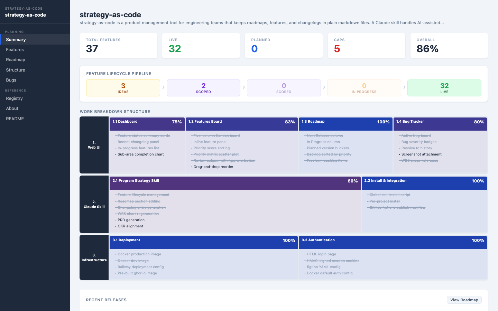
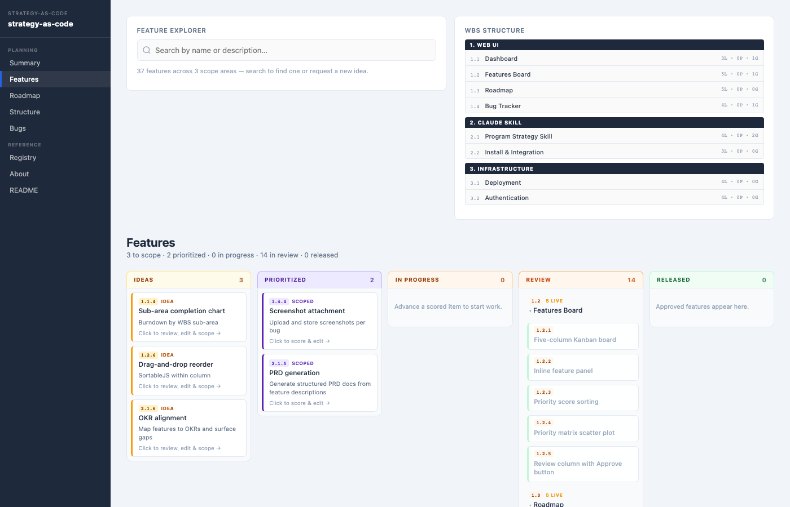
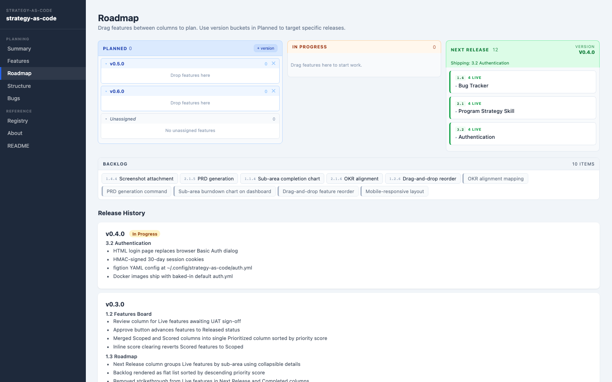
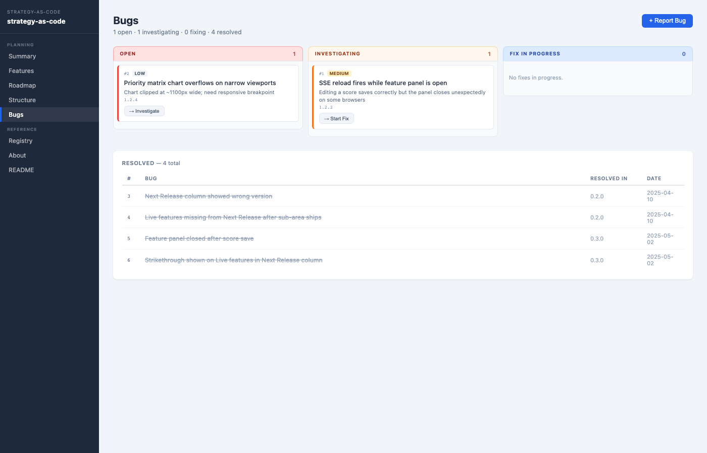

# strategy-as-code

Interface with: 

| Audience                      | Interface                        | Purpose                                   | File         |
| ----------                    | -----------                      | ---------                                 | ------       |
| Stakeholders                  | Web UI                           | Overview, WBS structure, feature registry | `PRODUCT.MD` |
| Operational and Dev Engineers | Claude skill & Markdown          | Operational and dev documentation         | `README.MD`  |
| Users                         | Markdown for app & documentation | Changelog and roadmap                     | `ABOUT.MD`   |
| All                           | Markdown & Web UI                | Bug tracking and triage                   | `BUGS.MD`    |

## Screenshots

**Summary** — feature counts, completion progress, and recent changelog



**Features** — five-column Kanban with WBS structure sidebar



**Roadmap** — Next Release, In Progress, Planned buckets, and Backlog



**Bugs** — active bug board with severity badges and resolved history



## How & Why

Each key interaction is captured in a respective markdown file. This enables AI-assisted and non-AI-human work directly from these files.

Other workflows for stakeholders, engineers, and end-users can derive everything they need from these sources of truth.

## Install the Claude skill

The `program-strategy` skill teaches Claude Code to manage your product documentation using the four-file format above.

**Global install** (available in all projects):

```bash
git clone https://github.com/dactylroot/strategy-as-code
cd strategy-as-code
./scripts/install-skill.sh
```

**Per-project install** (available only in one project):

```bash
./scripts/install-skill.sh /path/to/your/project
```

The script symlinks `.claude/skills/program-strategy/` into the target skill directory. Once installed, open any Claude Code session in the target project and invoke it with:

```
/program-strategy
```

The skill manages the four markdown files directly — reading and editing them in whichever directory the Claude Code session is open in.

To launch the web UI from within a skill session, tell Claude to run the UI:

```
run the UI
```

Claude will start the server pointed at the current project directory and open `http://localhost:8765` in your browser. The UI reads files on each page load, so edits the skill makes are visible immediately without restarting.

## Run the UI

### Local (Python)

Requires Python 3.12 and [pyenv](https://github.com/pyenv/pyenv).

```bash
pip install -r requirements.txt
PROJECT_DIR=/path/to/your/project ./run.sh
```

Runs on `http://localhost:8765`. Set `APP_TITLE` to override the page title:

```bash
APP_TITLE="My Product" PROJECT_DIR=/path/to/your/project ./run.sh
```

### Docker

Copy `.env.example` to `.env` and set your project path:

```bash
cp .env.example .env
# Edit .env: PROJECT_SOURCE_PATH=/path/to/your/project
```

Then start the container:

```bash
docker-compose up
```

Runs on `http://localhost:8765`.

### Pre-built image (ghcr.io)

```bash
docker run -p 8765:8000 \
  -v /path/to/your/project:/project \
  ghcr.io/dactylroot/strategy-as-code:latest
```

Supports `linux/amd64` and `linux/arm64`.

#### Environment variables

| Variable | Default | Description |
|----------|---------|-------------|
| `PROJECT_DIR` | `/project` | Path to project inside the container |
| `APP_TITLE` | Derived from `PRODUCT.MD` | UI page title |
| `PORT` | `8000` | Port to bind |
| `GIT_REPO_URL` | | Git repo to clone on first run |
| `GIT_TOKEN` | | HTTPS token for push/sync |
| `GIT_USER_NAME` | | Git commit author name |
| `GIT_USER_EMAIL` | | Git commit author email |
